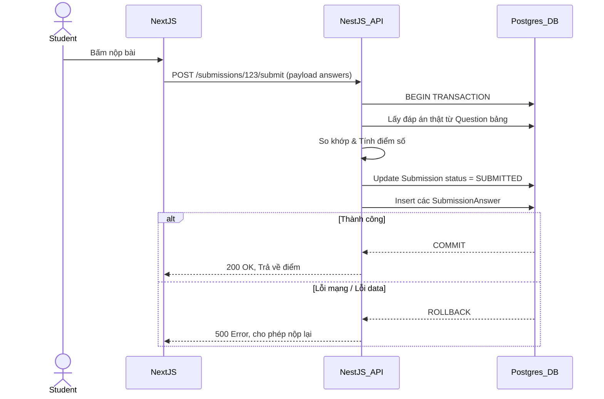

# Kiến Trúc Hệ Thống Luyện Đề Thi Online
*Tài liệu thiết kế bởi Senior Fullstack Architect*

## 1. Phân Tích Kiến Trúc Tổng Thể

Hệ thống được thiết kế theo hướng module hoá, phân tách rõ ràng giữa Client, API Layer và Background Processing Layer để đảm bảo khả năng chịu tải (scalable) và dễ bảo trì.

### Tech Stack Selection
* **Frontend:** Next.js (App Router), TypeScript, TailwindCSS, shadcn/ui. 
  * *Lý do:* Next.js hỗ trợ SSR/SSG tối ưu SEO cho landing page, đồng thời cung cấp UX mượt mà cho SPA (lúc làm bài thi). shadcn/ui giúp dựng UI dashboard Admin/Teacher nhanh, chuẩn enterprise.
* **Backend:** **NestJS** thay vì Next.js API Routes.
  * *Lý do:* Next.js API Routes (đặc biệt khi deploy serverless như Vercel) có giới hạn timeout (10-60s). Hệ thống thi online có các tác vụ nặng như OCR, AI parsing, và chấm điểm hàng loạt cần chạy background jobs (Queues/Workers). NestJS với kiến trúc DI (Dependency Injection) vững chắc, tích hợp sẵn `@nestjs/bull` (BullMQ) cực kỳ phù hợp cho bài toán này.
* **Database:** PostgreSQL (host trên Supabase).
* **Storage:** Supabase Storage.
* **Authentication:** JWT (JSON Web Token) kết hợp Role-Based Access Control (RBAC).
* **Background Jobs & Cache:** Redis (quản lý queue cho AI/OCR và caching đề thi).

---

## 2. Tại sao PostgreSQL phù hợp hơn MySQL/MongoDB?

1. **So với MongoDB (NoSQL):** Hệ thống giáo dục mang tính quan hệ (Relational) cực cao: `User -> Enrollment -> Class -> Exam -> Question -> Submission`. Việc maintain quan hệ chéo, chấm điểm, thống kê trên MongoDB cực kỳ vất vả và dễ sinh ra data inconsistency.
2. **So với MySQL:** PostgreSQL sở hữu kiểu dữ liệu `JSONB` vô địch. Câu hỏi thi rất đa dạng (Trắc nghiệm, Nhiều lựa chọn, Điền khuyết, Tự luận). Thay vì tạo nhiều bảng riêng lẻ cho từng loại, ta có thể lưu chung ở bảng `questions` với trường `metadata` dạng `JSONB` để linh hoạt nhưng vẫn có thể index để query nhanh.
3. **Transaction (ACID):** Quá trình nộp bài (Submit) yêu cầu insert vào bảng `submissions` và hàng chục record vào `submission_answers`. PostgreSQL xử lý transaction chặt chẽ, đảm bảo không có trạng thái "nộp bài một nửa".

---

## 3. Thiết Kế Database Schema (Chuẩn hoá Normalization)

> [!NOTE] 
> Thiết kế sử dụng Prisma schema format để thể hiện rõ các mối quan hệ.

```prisma
// SCHEMA PRISMA MINIMALIST
generator client {
  provider = "prisma-client-js"
}

datasource db {
  provider = "postgresql"
  url      = env("DATABASE_URL")
}

enum Role {
  ADMIN
  TEACHER
  STUDENT
}

enum ExamStatus {
  DRAFT
  PUBLISHED
  CLOSED
}

model User {
  id            String    @id @default(uuid())
  email         String    @unique
  passwordHash  String
  role          Role      @default(STUDENT)
  
  // Relations
  createdExams  Exam[]    @relation("TeacherExams")
  enrollments   Enrollment[]
  submissions   Submission[]
  files         UploadedFile[]
  
  createdAt     DateTime  @default(now())
}

model Class {
  id          String       @id @default(uuid())
  name        String
  teacherId   String
  
  enrollments Enrollment[]
  createdAt   DateTime     @default(now())
}

// Junction Table: Many-to-Many giữa User và Class
model Enrollment {
  userId      String
  classId     String
  user        User     @relation(fields: [userId], references: [id])
  class       Class    @relation(fields: [classId], references: [id])

  @@id([userId, classId])
}

model Exam {
  id          String      @id @default(uuid())
  title       String
  description String?
  teacherId   String
  teacher     User        @relation("TeacherExams", fields: [teacherId], references: [id])
  
  duration    Int         // minutes
  startTime   DateTime?
  endTime     DateTime?
  status      ExamStatus  @default(DRAFT)
  
  questions   Question[]
  submissions Submission[]
  
  createdAt   DateTime    @default(now())
}

model Question {
  id          String    @id @default(uuid())
  examId      String
  exam        Exam      @relation(fields: [examId], references: [id], onDelete: Cascade)
  
  type        String    // MULTIPLE_CHOICE, ESSAY...
  content     String    // HTML/Markdown text
  points      Float     @default(1.0)
  
  // metadata chứa JSON structure: choices, correct_answers, explanation
  metadata    Json      
  
  answers     SubmissionAnswer[]
}

model Submission {
  id          String    @id @default(uuid())
  examId      String
  userId      String
  exam        Exam      @relation(fields: [examId], references: [id])
  user        User      @relation(fields: [userId], references: [id])
  
  startTime   DateTime  @default(now())
  endTime     DateTime?
  status      String    // IN_PROGRESS, SUBMITTED
  score       Float?
  
  answers     SubmissionAnswer[]
  
  @@unique([examId, userId]) // Anti double submit
}

model SubmissionAnswer {
  id           String     @id @default(uuid())
  submissionId String
  questionId   String
  submission   Submission @relation(fields: [submissionId], references: [id], onDelete: Cascade)
  question     Question   @relation(fields: [questionId], references: [id])
  
  studentAnswer Json?     // Lựa chọn của học sinh
  isCorrect    Boolean?
  pointsAwarded Float?
}

model UploadedFile {
  id          String    @id @default(uuid())
  userId      String
  user        User      @relation(fields: [userId], references: [id])
  
  fileUrl     String
  status      String    // PENDING, PROCESSING, DONE, FAILED
  rawText     String?   @db.Text
  parsedJson  Json?
  
  createdAt   DateTime  @default(now())
}
```

---

## 4. Giải thích các Concepts trong Context

- **One-to-Many:** 1 `Exam` có nhiều `Questions`. Khi tải đề thi, hệ thống join từ Exam ra danh sách Questions tương ứng.
- **Many-to-Many & Junction Table:** Bảng `Enrollment` là junction table nối `User` (học sinh) và `Class`. Một học sinh học nhiều lớp, một lớp có nhiều học sinh.
- **Foreign Key:** `teacherId` trong `Exam` tham chiếu tới `User(id)`. Ngăn chặn việc gán đề thi cho một user không tồn tại.
- **Indexing:** Bắt buộc đánh index trên `(examId, userId)` của bảng `Submission` vì đây là query chạy liên tục để xem học sinh đã nộp bài chưa.
- **Cascade Delete:** Khi xoá `Submission`, các `SubmissionAnswer` liên quan bị xoá tự động (`onDelete: Cascade`). Tuy nhiên, KHÔNG dùng cascade khi xoá `User` để giữ lại lịch sử hệ thống (dùng Soft Delete thay thế).
- **Transaction:** Khi nộp bài, hệ thống phải cập nhật `Submission.status = 'SUBMITTED'` và tính điểm ghi vào `SubmissionAnswer` trong cùng 1 Transaction để tránh lỗi data.

---

## 5 & 6. Flow Upload Đề & JSON Structure

### JSON Structure cho Câu Hỏi (Lưu trong `metadata` JSONB)
```json
{
  "type": "MULTIPLE_CHOICE",
  "choices": [
    {"id": "A", "content": "Hàm số đồng biến"},
    {"id": "B", "content": "Hàm số nghịch biến"},
    {"id": "C", "content": "Không xác định"}
  ],
  "correct_answers": ["A"],
  "explanation": "Dựa vào bảng biến thiên..."
}
```

### Flow Upload & AI Parsing (Event-Driven)
1. Thầy cô upload PDF/DOCX qua Next.js lên Supabase Storage.
2. Next.js lấy public URL, gọi API NestJS `POST /api/upload-exam`.
3. NestJS lưu DB bảng `UploadedFile` (status: PENDING) và push ID vào Redis Queue (BullMQ).
4. Worker pick job:
   - Dùng `pdf-parse` hoặc `mammoth` hoặc Tesseract OCR để bóc tách toàn bộ Text.
   - Gửi Raw Text vào Prompt cho LLM (OpenAI/Gemini).
   - **Prompt Engineering:** Yêu cầu LLM trả về đúng JSON Schema đã định nghĩa ở trên (dùng OpenAI Function Calling hoặc JSON Mode).
5. Nhận kết quả từ LLM, lưu vào trường `parsedJson`. Cập nhật file status thành `DONE`.
6. Frontend dùng SSE/WebSocket hoặc Polling nhận thông báo và render ra màn hình Review cho giáo viên duyệt trước khi Insert thành các `Question` thực sự.

---

## 7. Thiết Kế RBAC

* **Quy trình:** Token (chứa role) -> Guard lấy role -> So khớp với Metadata Decorator.

```typescript
// roles.decorator.ts
import { SetMetadata } from '@nestjs/common';
export const Roles = (...roles: string[]) => SetMetadata('roles', roles);

// roles.guard.ts
@Injectable()
export class RolesGuard implements CanActivate {
  constructor(private reflector: Reflector) {}
  canActivate(context: ExecutionContext): boolean {
    const requiredRoles = this.reflector.getAllAndOverride<string[]>('roles', [context.getHandler(), context.getClass()]);
    if (!requiredRoles) return true;
    const { user } = context.switchToHttp().getRequest();
    return requiredRoles.includes(user.role); // e.g. 'TEACHER'
  }
}
```

---

## 8. RESTful API Design Chuẩn

* **Auth:**
  * `POST /auth/login`, `POST /auth/register`
* **Exams:**
  * `GET /exams` (List kèm filter/pagination)
  * `POST /exams` (Tạo đề - Yêu cầu Role: TEACHER)
  * `GET /exams/:id` (Lấy detail đề)
  * `GET /exams/:id/take` (Học sinh load đề thi - API này KHÔNG trả về `correct_answers`)
* **Submissions:**
  * `POST /exams/:id/start` (Bắt đầu tính giờ, tạo record IN_PROGRESS)
  * `PATCH /submissions/:id/autosave` (Lưu nháp câu trả lời)
  * `POST /submissions/:id/submit` (Nộp bài chính thức)
* **OCR/Upload:**
  * `POST /ocr/upload` (Trigger background job)
  * `GET /ocr/jobs/:id` (Kiểm tra trạng thái)

---

## 9. Next.js vs NestJS & Microservices

> [!WARNING]
> Sinh viên thường nhét mọi thứ vào Next.js API Routes. Hệ quả là khi gọi OpenAI API quá 15s, Vercel cắt request trả về 504 Gateway Timeout.

* **MVP / Backend Architecture:** Tách bạch. Frontend chạy Next.js (Vercel). Backend chạy NestJS (trên Render/Railway/AWS EC2) vì backend làm xử lý file nặng và chạy worker daemon.
* **Khi nào cần Microservices:** Ban đầu cứ dùng **Modular Monolith** (chia module trong NestJS). Chỉ cắt Microservice ra khi tính năng AI Parsing/OCR tốn quá nhiều CPU làm lag các request nộp bài thi của học sinh. Lúc đó cắt riêng `AiParsingWorkerService`.
* **Vai trò của Redis:** Vô cùng quan trọng trong hệ thống này.
  1. Queue cho xử lý file bằng BullMQ.
  2. Cache đề thi: 8:00 AM thứ Hai có 2,000 học sinh vào thi cùng 1 đề. Nếu query Postgres liên tục sẽ sập -> Cache payload `GET /exams/:id/take` vào Redis.

---

## 10. Anti-Cheat & Xử Lý Sự Cố Lúc Thi

1. **Timer Sync:** Không tin tưởng đồng hồ máy tính học sinh. Backend lưu `startTime` và `duration`. Client chỉ nhận `endTime` bằng Unix Timestamp để đếm ngược. Backend từ chối chấm điểm nếu request nộp gửi lên sau `endTime + 1 phút grace period`.
2. **Anti Double Submit:** Dùng Prisma `@@unique([examId, userId])` kết hợp kiểm tra status `SUBMITTED`.
3. **Autosave:** Học sinh chọn đáp án -> gọi `PATCH /autosave`. Lỡ cúp điện rớt mạng, vào lại vẫn còn bài.
4. **Visibility Change:** Dùng JS Browser API để count số lần học sinh đổi tab (blur window).

---

## 11. Folder Structure & Patterns (NestJS)

```
src/
├── common/             # Guards, Interceptors, Filters, Decorators
├── infrastructure/     # PrismaService, RedisService, SupabaseService
├── modules/
│   ├── auth/
│   ├── exam/
│   │   ├── exam.controller.ts
│   │   ├── exam.service.ts
│   │   ├── exam.repository.ts  # Tách giao tiếp DB ra khỏi Service
│   │   └── dto/
│   ├── submission/
│   └── parser/         # Chứa BullMQ worker xử lý OCR & AI
└── main.ts
```

---

## 12. Roadmap Xây Dựng

* **Phase 1 (MVP):** Thi trắc nghiệm thuần túy. Giáo viên tạo câu hỏi thủ công. Học sinh làm bài, tự động chấm điểm.
* **Phase 2 (File Handling):** Hỗ trợ import đề thi bằng file Excel template (dễ build, ổn định cao).
* **Phase 3 (OCR & AI):** Upload PDF, bóc tách text, đưa cho Gemini/OpenAI tạo ra JSON form tự động. Teacher chỉ việc review lại.
* **Phase 4 (Scale & Enterprise):** Thêm Redis Caching, WebSockets monitor phòng thi realtime cho giáo viên, chống gian lận nâng cao.

---

## 13. Sơ đồ hệ thống

### ERD Cơ bản
```mermaid
erDiagram
    USER ||--o{ ENROLLMENT : "has"
    CLASS ||--o{ ENROLLMENT : "has"
    USER ||--o{ EXAM : "creates (Teacher)"
    USER ||--o{ SUBMISSION : "makes (Student)"
    EXAM ||--o{ QUESTION : "contains"
    EXAM ||--o{ SUBMISSION : "receives"
    SUBMISSION ||--o{ SUBMISSION_ANSWER : "has"
    QUESTION ||--o{ SUBMISSION_ANSWER : "matched with"
```

### Flow Nộp Bài Tránh Sai Sót (Transaction)


---

## 14. Best Practices & Security

* **Tuyệt đối không lộ đáp án:** Endpoint `/exams/:id/take` để học sinh lấy đề thi **PHẢI** loại bỏ (omit) trường `correct_answers` trong JSONB `metadata` trước khi trả về (Dùng DTO transform).
* **Rate Limit Nộp Bài:** Đặt RateLimit bằng Redis cho Endpoint Submit (1 request / 5 giây) để tránh user bấm đúp nút nộp sinh ra race condition.
* **Security Middleware:** Dùng Helmet cho các HTTP headers, CORS cho đúng domain frontend, không dùng JWT lưu LocalStorage mà đẩy vào `HttpOnly Cookies` chống XSS đánh cắp phiên.

---

## 15. Code Example: Submission Transaction với Prisma

Đoạn code minh hoạ Service Layer Pattern xử lý việc chấm điểm bằng DB Transaction an toàn tuyệt đối.

```typescript
import { Injectable, BadRequestException } from '@nestjs/common';
import { PrismaService } from 'src/infrastructure/prisma.service';

@Injectable()
export class SubmissionService {
  constructor(private prisma: PrismaService) {}

  async submitExam(submissionId: string, studentAnswers: Record<string, string>) {
    return this.prisma.$transaction(async (tx) => {
      // 1. Lấy trạng thái hiện tại và lock row
      const submission = await tx.submission.findUnique({
        where: { id: submissionId },
        include: { exam: { include: { questions: true } } }
      });

      if (!submission) throw new BadRequestException('Not found');
      if (submission.status === 'SUBMITTED') throw new BadRequestException('Already submitted');
      
      // Kiểm tra hết giờ (backend check)
      if (new Date() > new Date(submission.exam.endTime.getTime() + 60000)) {
         throw new BadRequestException('Time is up');
      }

      let totalScore = 0;
      const answerRecords = [];

      // 2. Chấm điểm từng câu
      for (const question of submission.exam.questions) {
        const studentAns = studentAnswers[question.id];
        const meta = question.metadata as any; // Type ép kiểu
        const correctAns = meta.correct_answers[0]; 
        
        const isCorrect = studentAns === correctAns;
        const points = isCorrect ? question.points : 0;
        totalScore += points;

        answerRecords.push({
          submissionId,
          questionId: question.id,
          studentAnswer: studentAns || null,
          isCorrect,
          pointsAwarded: points
        });
      }

      // 3. Cập nhật vào DB
      await tx.submissionAnswer.createMany({ data: answerRecords });
      
      const updatedSubmission = await tx.submission.update({
        where: { id: submissionId },
        data: { 
          status: 'SUBMITTED', 
          score: totalScore,
          endTime: new Date()
        }
      });

      return updatedSubmission;
    });
  }
}
```

---

## 16. Common Mistakes Sinh Viên Hay Mắc Phải

1. **Gửi đáp án xuống Client:** Lưu đáp án trong React State hoặc DOM (vd `data-correct="true"`). Học sinh Inspect Element F12 là được 10 điểm.
2. **Chấm điểm ở Frontend:** Cho Frontend so khớp đáp án rồi gửi payload `{"score": 10}` lên Backend. Lỗ hổng cực lớn, học sinh dùng Postman gửi score 10 là xong. Điểm số BẮT BUỘC phải tính ở Backend bằng cách check db độc lập.
3. **Quên Transaction:** Cập nhật trạng thái 'Nộp bài' thành công, nhưng insert chi tiết câu trả lời bị lỗi. Học sinh bị đánh rớt mạng, lúc sau vào lại hệ thống báo "đã nộp bài" nhưng điểm = 0 vì không có câu trả lời nào được lưu.
4. **Không index Foreign Key:** Bảng submission có triệu record. Câu lệnh `WHERE userId = 'abc'` không có index sẽ quét full table (Seq Scan), làm sập DB.
